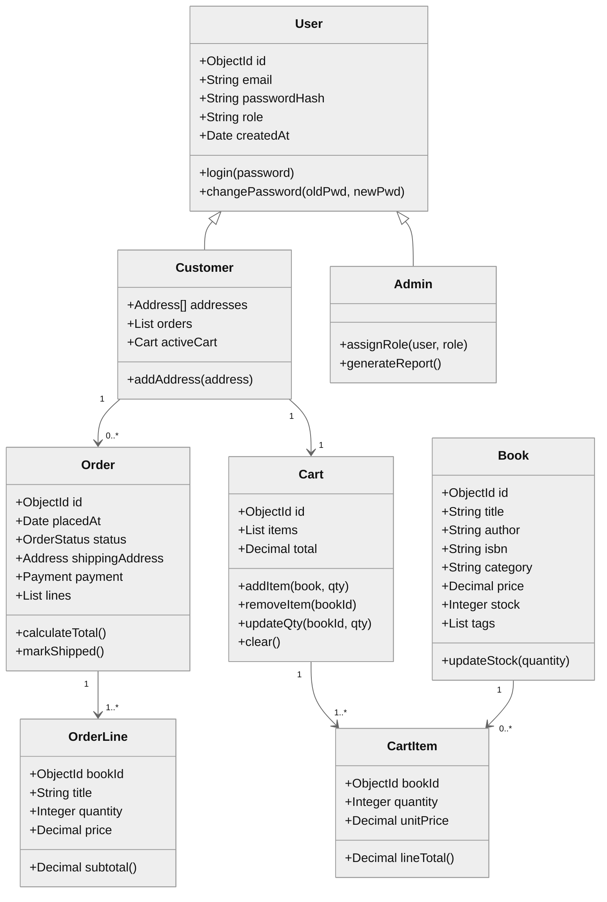
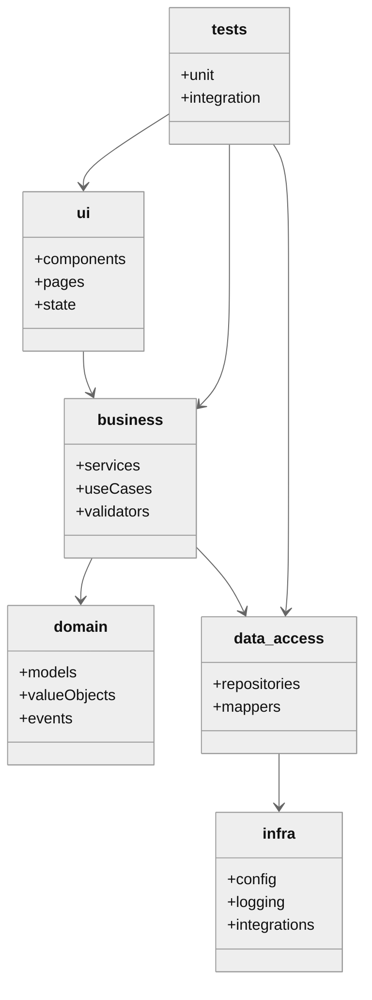
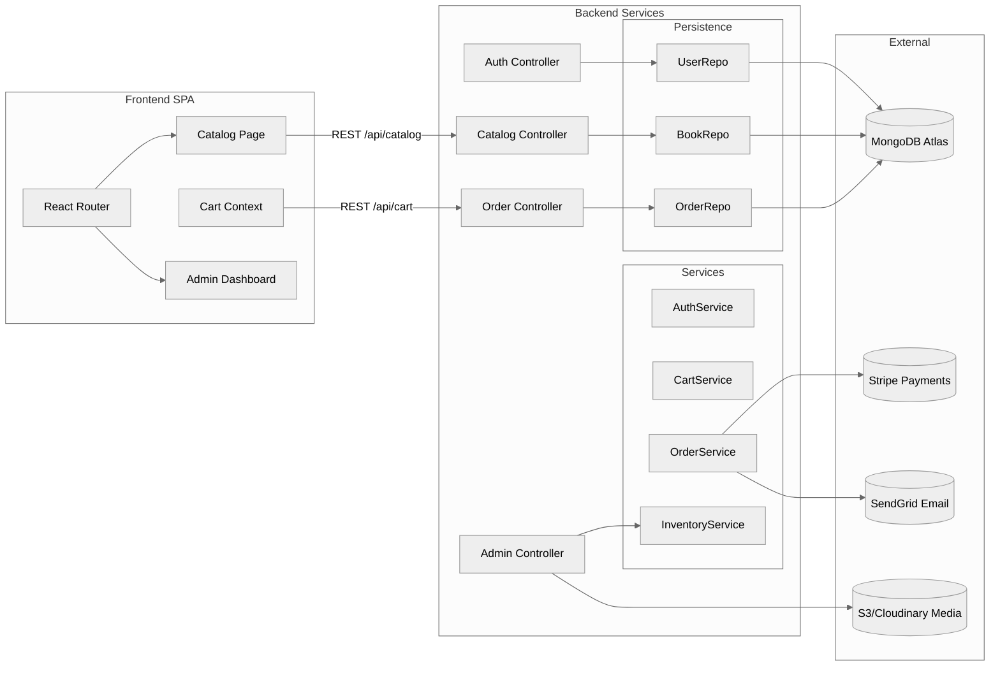
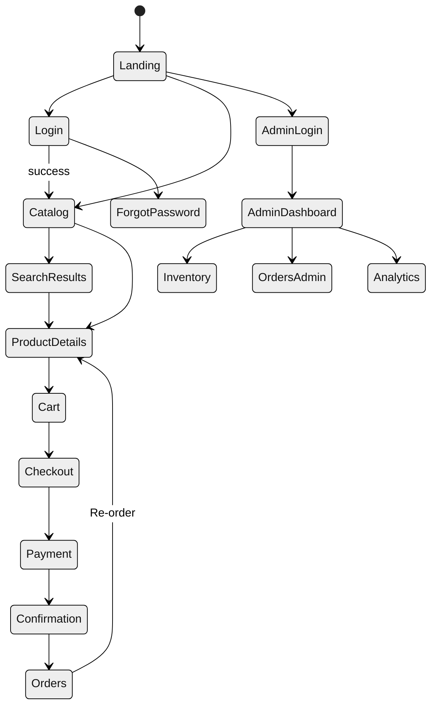

# Aplicatto Bookstore Platform — Architecture & Implementation Plan

## Overview
- **Purpose:** Transform the existing Aplicatto web presence into a full-stack e-commerce platform focused on selling books.
- **Technology Stack:** React (frontend), Node.js + Express (backend API), MongoDB (database), Docker (containerization), GitHub + GitHub Actions (CI/CD).
- **Architecture Paradigm:** Layered MVC with RESTful services, Object-Oriented domain modeling, reusable component-driven UI.
- **Guiding Principles:** SOLID, clean code, security-by-design, scalability, maintainability, testability, and continuous delivery.

---

## System Requirements
### Functional Requirements
| Epic | Requirement | Notes |
| --- | --- | --- |
| User Authentication | Secure registration (email verification optional), login, logout, password reset | JWT access + refresh tokens, bcrypt hashing |
| Catalog Browsing | View featured books, filter by category/genre, author, price, rating; keyword search | Pagination + sorting |
| Product Details | Detailed view with cover, synopsis, stock, reviews, related titles | Supports rich media |
| Shopping Cart | Add/remove/update quantity, persisted per user/session | Observer pattern to sync cart badge |
| Checkout & Payments | Shipping info, payment integration (Stripe), order confirmation email | Follows PCI-DSS guidelines |
| Order Management | Order history, status tracking, downloadable invoice | Users see own orders; admins manage all |
| Admin Dashboard | CRUD for books, categories, promotions; order fulfillment; analytics snapshots | RBAC: Admin role |
| Content & CMS | Landing pages, featured collections, blog posts | Leverage existing site components |

### Non-Functional Requirements
- **Performance:** <200 ms API latency for common operations; client-side code splitting via React.lazy.
- **Availability:** 99.5% uptime target using managed hosting (e.g., Vercel or AWS).
- **Scalability:** Horizontal scaling of API through stateless containers; MongoDB Atlas auto-scaling.
- **Maintainability:** Modular package structure, linting (ESLint + Prettier), TypeScript-ready patterns.
- **Security:** HTTPS enforced, OWASP top-10 mitigations, rate limiting, audit logging.
- **Observability:** Structured logging (Winston), metrics (Prometheus/Grafana), error tracking (Sentry).

---

## User Stories & Use Cases

### Representative User Stories
- *As a visitor, I want to browse featured books so that I can discover popular titles.*
- *As a customer, I want to search for books by keyword so that I can find relevant titles efficiently.*
- *As a customer, I want to filter books by author and category to narrow down my choices.*
- *As a customer, I want to add books to my cart and adjust quantities to manage my purchase before checkout.*
- *As a customer, I want to store my shipping addresses and payment information securely for faster checkout.*
- *As a customer, I want to view my order history so that I can track deliveries and re-order.*
- *As an admin, I want to add new books with metadata so that the catalog stays up to date.*
- *As an admin, I want to monitor sales metrics on a dashboard to make informed decisions.*

### Use Case Diagram
```mermaid
%%{init: {'theme': 'neutral'}}%%
usecaseDiagram
  actor Customer
  actor Admin
  actor Visitor

  rectangle "Aplicatto Bookstore" {
    Customer --> (Register / Login)
    Customer --> (Search Catalog)
    Customer --> (Manage Cart)
    Customer --> (Checkout & Pay)
    Customer --> (Track Orders)

    Visitor --> (Browse Catalog)
    Visitor --> (Read Blog / Content)

    Admin --> (Manage Inventory)
    Admin --> (Manage Orders)
    Admin --> (View Analytics)
  }
```

---

## Development Methodology (Agile Scrum in VS Code)
- **Sprint Length:** 2 weeks with sprint planning, backlog grooming, review, and retrospective.
- **Ceremonies:** Daily 15-minute stand-ups, sprint reviews with stakeholders, retrospectives for continuous improvement.
- **Artifacts:** Product backlog in Jira/GitHub Projects, sprint backlog, Definition of Done (DoD), Definition of Ready (DoR).
- **VS Code Utilization:**
  - IntelliSense & ESLint integration for consistent code quality.
  - Built-in debugger for Node.js and browser-based debugging via Chrome DevTools.
  - Git integration for branching, PR reviews, and blame.
  - Live Share for pair programming; REST Client extension for API testing.

---

## Architectural Layers & MVC Alignment
| Layer | Responsibilities | Packages / Components |
| --- | --- | --- |
| **Presentation (UI)** | React SPA, routing, state management via Redux Toolkit or Zustand, Material UI components | `packages/ui`, `components`, `pages`, `hooks` |
| **Business Logic (Application)** | Use cases, services, input validation, orchestration of domain objects | `packages/services`, `use-cases` |
| **Domain Model** | Entities (User, Book, Order, CartItem), value objects (Address, PaymentMethod) encapsulating business rules | `packages/domain/models` |
| **Data Access** | Repositories interacting with MongoDB through Mongoose | `packages/data-access`, `repositories` |
| **Persistence** | MongoDB collections, schema definitions, migrations (Mongoose) | `packages/persistence` |
| **Infrastructure** | Configuration, logging, messaging (email), external integrations (Stripe) | `packages/infra`, `config`, `utils` |

### Object-Oriented & Design Principles
- **Encapsulation:** Domain models expose behavior (e.g., `Cart.addItem(book, qty)`) hiding persistence concerns.
- **Inheritance/Polymorphism:** Base `User` class with `Customer` and `Admin` specializations controlling permissions.
- **SOLID:** Single Responsibility (controllers only coordinate), Open/Closed via strategy for discount calculation, Dependency Inversion with interfaces for repositories.
- **Design Patterns:**
  - MVC for route-controller-service separation.
  - Singleton for configuration manager (env variables).
  - Observer (Publish/Subscribe) for cart updates and notification service.
  - Factory Method for payment provider instantiation (Stripe, PayPal).

---

## Domain Class Diagram


---

## Package Diagram


---

## Component Diagram


---

## Navigation Map


---

## Security Architecture
- **Transport:** Enforce HTTPS via reverse proxy (NGINX) and HSTS header.
- **Authentication:** JWT access tokens (15 min) + refresh tokens (7 days) stored in HttpOnly cookies; MFA optional for admins.
- **Authorization:** RBAC with roles (`customer`, `admin`) and policy-based middleware.
- **Data Protection:** bcrypt with cost factor 12 for passwords; Stripe Checkout for payment tokens; encrypt sensitive fields (addresses, payment history) using AES-256 with KMS-managed keys.
- **Input Sanitization:** Celebrate/Joi validation, express-rate-limit, helmet for HTTP headers, sanitize-html for user-generated content.
- **Auditing:** Activity logs for admin changes; anomaly detection for login attempts.

---

## Sample Code Snippets
### Express Authentication Endpoint (`src/controllers/auth.controller.ts`)
```javascript
import { Router } from 'express';
import { authService } from '../services/auth.service.js';
import { validateBody } from '../middleware/validate.js';
import { loginSchema } from '../validators/auth.schemas.js';

const router = Router();

router.post('/login', validateBody(loginSchema), async (req, res, next) => {
  try {
    const { token, refreshToken, user } = await authService.login(req.body);
    res
      .cookie('refreshToken', refreshToken, {
        httpOnly: true,
        secure: true,
        sameSite: 'strict'
      })
      .status(200)
      .json({ token, user });
  } catch (error) {
    next(error);
  }
});

export default router;
```

### Mongoose User Model (`src/models/user.model.ts`)
```javascript
import { Schema, model } from 'mongoose';
import bcrypt from 'bcryptjs';

const userSchema = new Schema(
  {
    email: { type: String, required: true, unique: true },
    passwordHash: { type: String, required: true },
    role: { type: String, enum: ['customer', 'admin'], default: 'customer' },
    addresses: [{ type: Schema.Types.Mixed }]
  },
  { timestamps: true }
);

userSchema.methods.verifyPassword = function verifyPassword(candidate) {
  return bcrypt.compare(candidate, this.passwordHash);
};

userSchema.pre('save', async function hashPassword(next) {
  if (!this.isModified('passwordHash')) return next();
  this.passwordHash = await bcrypt.hash(this.passwordHash, 12);
  next();
});

export const UserModel = model('User', userSchema);
```

### React Product Listing Component (`src/components/catalog/ProductGrid.tsx`)
```javascript
import { useEffect, useState } from 'react';
import { Grid, Card, CardMedia, CardContent, Typography, Button } from '@mui/material';
import { catalogApi } from '../../services/catalogApi';

export function ProductGrid({ filters }) {
  const [books, setBooks] = useState([]);

  useEffect(() => {
    catalogApi.fetchBooks(filters).then(setBooks);
  }, [filters]);

  return (
    <Grid container spacing={3}>
      {books.map((book) => (
        <Grid key={book.id} item xs={12} sm={6} md={4}>
          <Card>
            <CardMedia component="img" height="240" image={book.coverUrl} alt={book.title} />
            <CardContent>
              <Typography variant="h6">{book.title}</Typography>
              <Typography variant="subtitle2" color="text.secondary">
                {book.author}
              </Typography>
              <Typography variant="body1">${book.price.toFixed(2)}</Typography>
              <Button variant="contained" onClick={() => catalogApi.addToCart(book.id)}>
                Add to cart
              </Button>
            </CardContent>
          </Card>
        </Grid>
      ))}
    </Grid>
  );
}
```

### Jest Unit Test Example (`__tests__/auth.service.test.ts`)
```javascript
import { authService } from '../src/services/auth.service';
import { UserModel } from '../src/models/user.model';

jest.mock('../src/models/user.model');

describe('authService.login', () => {
  it('returns token for valid credentials', async () => {
    UserModel.findOne.mockResolvedValue({
      email: 'reader@example.com',
      verifyPassword: jest.fn().mockResolvedValue(true)
    });

    const result = await authService.login({ email: 'reader@example.com', password: 'secret123' });

    expect(result.token).toBeDefined();
    expect(result.user.email).toBe('reader@example.com');
  });

  it('throws error for invalid credentials', async () => {
    UserModel.findOne.mockResolvedValue(null);
    await expect(
      authService.login({ email: 'reader@example.com', password: 'wrong' })
    ).rejects.toThrow('Invalid credentials');
  });
});
```

---

## Libraries, Frameworks & Tooling
- **Frontend:** React 18, React Router v6, Redux Toolkit/Zustand, Material UI, React Hook Form, Axios, TanStack Query (for caching).
- **Backend:** Express 5, Mongoose, Joi/Celebrate, bcryptjs, jsonwebtoken, Stripe SDK, Helmet, Winston, Day.js.
- **Testing:** Jest, React Testing Library, Supertest for API, Cypress for E2E.
- **Build & Quality:** Vite or Create React App (frontend), TypeScript, ESLint (airbnb + Prettier), Husky for pre-commit hooks, lint-staged.
- **DevOps:** Docker, docker-compose, GitHub Actions, Dependabot.

---

## Version Control Strategy
- **Repository Setup:**
  ```bash
  git init
  git remote add origin git@github.com:Beneli06/aplicatto-bookstore.git
  git branch -M main
  git push -u origin main
  ```
- **Branching Model:** GitFlow or Trunk-based hybrid.
  - `main`: production-ready, tagged releases.
  - `develop`: integration branch.
  - Feature branches: `feature/auth`, `feature/catalog-search`.
  - Release branches: `release/v1.0.0`, hotfix `hotfix/payment-timeout`.
- **Workflow:**
  1. `git checkout -b feature/auth`
  2. Implement + tests in VS Code.
  3. `git commit -am "Implement user login"`
  4. PR to `develop`, squash merge after review.
  5. CI runs tests via GitHub Actions; require approval before merge.
  6. Periodic merges into `main` with release tagging and changelog updates.

---

## Server & Infrastructure Configuration
- **Express Server:**
  - `server/index.ts` bootstraps Express with Helmet, CORS, compression.
  - Environment variables via `dotenv` (`PORT`, `JWT_SECRET`, `MONGODB_URI`, `STRIPE_KEY`).
  - Request validation middleware and centralized error handler.
- **MongoDB:**
  - Hosted on MongoDB Atlas (M10 cluster), network access limited via IP allowlist.
  - Schema validation using Mongoose, indexes for `title`, `author`, `category`.
  - Aggregation pipelines for analytics.
- **Docker:**
  - `Dockerfile` for frontend (multi-stage build) and backend.
  - `docker-compose.yml` orchestrates `client`, `api`, `mongo`, `mongo-express`, `nginx` for SSL termination.
- **Deployment Targets:**
  - Frontend on Vercel/Netlify or S3 + CloudFront.
  - API on Render, Heroku, or AWS ECS.
  - CDN for static assets (images, CSS).

---

## CI/CD Pipeline (GitHub Actions)
- **Workflows:**
  - `ci.yml`: lint, unit tests, build frontend, run API tests.
  - `deploy.yml`: triggered on tags; builds Docker images, pushes to registry, deploys via Terraform/Serverless.
- **Stages:** Install dependencies, cache modules, run tests, build artifacts, security scans (npm audit, Snyk), deploy to staging, manual approval to production.

---

## Testing Strategy
- **Unit Tests:** Jest for services, controllers; React Testing Library for components.
- **Integration Tests:** Supertest hitting Express routes with in-memory MongoDB (mongodb-memory-server).
- **E2E Tests:** Cypress simulating user flows (login, search, checkout).
- **Performance Tests:** Artillery or k6 for checkout endpoints.
- **Static Analysis:** ESLint, TypeScript (strict mode), SonarCloud optional.
- **Code Coverage:** Minimum 85% enforced via Jest config.

### Authentication Workflow QA (Postman)
- Store the Postman collection and environment under `test/postman/`.
- Execute the "Authentication Workflow" collection on each feature branch; the scripts auto-handle login, conditional registration, and token storage.
- Expose collection results in CI via Newman (`newman run ... --reporter-html-export reports/auth-workflow.html`).
- Mirror Postman assertions in frontend toast messages and integration tests to keep UX feedback consistent with API responses.

---

## Deployment & Environments
| Environment | Purpose | Hosting | Config |
| --- | --- | --- | --- |
| Local | Developer machines (Node.js v18, npm 10) | Docker Compose or direct | `.env.local`, hot reload, seeded data |
| CI | Automated tests | GitHub Actions | Secrets stored in GitHub Secrets |
| Staging | QA & stakeholder review | Heroku/AWS Elastic Beanstalk | `.env.staging`, connected to staging MongoDB |
| Production | Live customers | AWS ECS + ALB, MongoDB Atlas | `.env.production`, logging to CloudWatch |

- **Monitoring:** AWS CloudWatch alarms, Sentry for frontend/backend error tracking, Datadog APM optional.
- **Backups:** MongoDB Atlas automated backups + retention.

---

## Roadmap & Sprint Breakdown
1. **Sprint 0 (1 week):** Project setup, infrastructure, CI/CD, design system, database schema definition.
2. **Sprint 1:** Auth module (register/login/password reset), landing page.
3. **Sprint 2:** Catalog browsing, search, filters, pagination.
4. **Sprint 3:** Cart service, checkout flow, integrations with Stripe sandbox.
5. **Sprint 4:** Order history, admin CRUD, analytics MVP.
6. **Sprint 5:** Content migration, SEO, accessibility enhancements.
7. **Sprint 6:** Performance optimization, security hardening, launch readiness.

---

## Risk & Mitigation
- **Payment Compliance:** Use hosted payment pages (Stripe Checkout) to minimize PCI scope.
- **Data Privacy:** GDPR compliance with user consent, data export/delete features.
- **Scalability:** Use message queues (BullMQ + Redis) for email sending and stock sync to avoid blocking requests.
- **Vendor Lock-in:** Abstract integrations via service interfaces to swap providers.

---

## Appendix
- **VS Code Extensions:** ESLint, Prettier, GitLens, REST Client, Docker, Thunder Client, Jest Runner.
- **Documentation Tools:** Storybook for UI, Swagger/OpenAPI for API contract, Notion/Confluence for knowledge base.
- **Reference Standards:** OWASP ASVS Level 2, ISO/IEC 27001 controls alignment, WCAG 2.1 AA accessibility.
